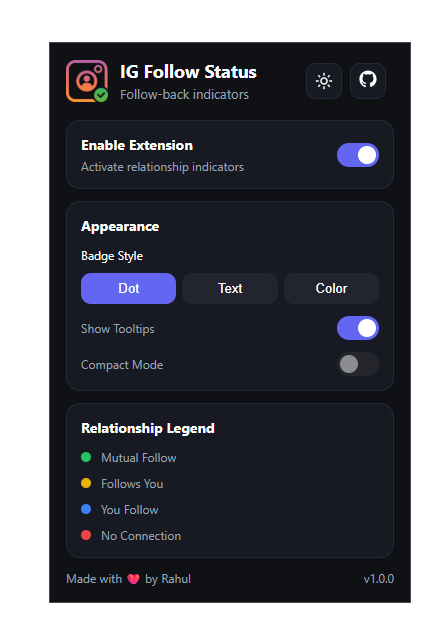

# IG Follow Status

A Chrome extension that shows whether an Instagram user follows you back directly on their profile page.

Stop switching between Followers and Following lists. Open any Instagram profile and instantly see your relationship status.


---

## 🔗 Install from Chrome Web Store

<p align="left">
  <a href="https://chromewebstore.google.com/detail/ig-follow-status/ekbfefppjpejddfgogjjajlnphcgnhac" target="_blank">
    
  </a>
</p>

---

## Features

### Relationship Indicators

IG Follow Status detects and displays one of the following relationship states:

| Status         | Meaning                |
| -------------- | ---------------------- |
| 🟢 Mutual      | You follow each other  |
| 🟡 Follows You | They follow you        |
| 🔵 Following   | You follow them        |
| 🔴 None        | No follow relationship |

---

### Multiple Display Modes

Choose how indicators appear on profile pages:

- Dot Only
- Text Only
- Dot + Text
- Username Color

---

### Compact Mode

Reduce indicator size for a cleaner Instagram experience.

---

### Tooltips

Hover over an indicator to view the full relationship status.

---

### Popup Themes

Customize the extension popup with:

- System Theme
- Light Theme
- Dark Theme

---

### Real-Time Updates

Settings are applied instantly without refreshing Instagram.

---

## Installation

### Developer Mode

1. Clone this repository:

```bash
git clone https://github.com/YOUR_USERNAME/ig-follow-status.git
```

2. Open Chrome Extensions:

```text
chrome://extensions
```

3. Enable **Developer Mode**

4. Click **Load unpacked**

5. Select the extension folder

6. Open Instagram and visit any profile

---

## Screenshots

### Extension Popup



---

## Privacy

IG Follow Status runs entirely inside your browser.

The extension:

- Does not collect personal information
- Does not send data to external servers
- Does not track browsing activity
- Does not require a separate account

All relationship detection is performed locally using Instagram profile data already available in your browser session.

---

## Permissions

### Storage

Used to save:

- Extension state
- Badge style
- Compact mode preference
- Tooltip preference
- Theme preference

### Instagram Access

Required to display relationship indicators on Instagram profile pages.

---

## Project Structure

```text
ig-follow-status/
│
├── icons/
├── popup/
├── content/
├── shared/
│
├── manifest.json
├── README.md
├── LICENSE
└── CHANGELOG.md
```

---

## Contributing

Issues, feature requests, and pull requests are welcome.

If you discover a bug or have an idea for improvement, feel free to open an issue.

---

## 📄 License

This project is licensed under the MIT License — see the [LICENSE](LICENSE) file for details.

---

Made with ❤️ by Rahul
